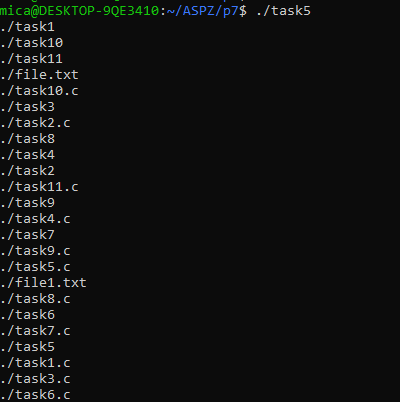
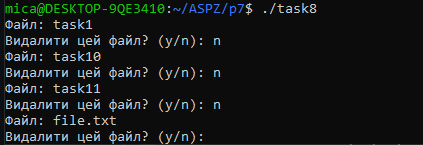
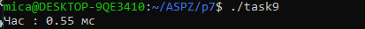

# Практична 1 (pr1)

## Опис
Цей скрипт на Bash шукає бібліотеки у `/usr/lib` і перевіряє, чи є в них функції `sin`, `cos` та `exp`. Він перебирає всі `.so` файли та перевіряє їх за допомогою `nm -D`.

## Як запустити
1. Клонуйте репозиторій:
   ```bash
   git clone https://github.com/mish0ch3k/APZ
   ```
2. Дайте файлу права на виконання:
   ```bash
   chmod +x find_functions.sh
   ```
3. Запустіть у терміналі:
   ```bash
   ./find_functions.sh
   ```

## Як це працює
- `LIB_DIR` – це папка, де шукаємо бібліотеки (за замовчуванням `/usr/lib`).
- `FUNCTIONS` – список функцій, які шукаємо (`sin`, `cos`, `exp`).
- Скрипт шукає всі `.so` файли в папці `LIB_DIR`.
- За допомогою `nm -D` перевіряє, чи є в них потрібні функції.
- Якщо знайдено, виводить щось типу:
  ```
  Lib /usr/lib/libm.so have func sin
  ```

## Вимоги
- Linux або WSL (Windows Subsystem for Linux)
- Утиліта `nm` (з пакету `binutils`)

## Як змінити цільову директорію для перевірки
Якщо потрібно перевіряти іншу папку, змініть `LIB_DIR`, наприклад:
```bash
LIB_DIR="/lib/x86_64-linux-gnu"
```


# Практична 2 (pr2)

## Опис

Ця практична містить приклади програм і дослідження архітектури виконуваних файлів, памʼяті процесу (stack, heap, data, bss, text), функції `mmap()` проти `malloc()`, і аналізу стеку за допомогою `gstack` та `gdb`.

## Як запустити

```bash
git clone https://github.com/mish0ch3k/APZ
cd APZ
gcc p21.c -o time_check
./time_check

gcc p23.c -o segments
./segments

gcc mmap.c -o test_mmap
./test_mmap
```
Файл p24 потрібно запускати окремо, потім відкрити інший термінал і виконати:
```bash
gcc p24.c -o trace
./trace    
gstack <PID>       # або
gdb -p <PID> -> bt
```

## Аналіз mmap vs malloc
-malloc.c — виділяє 10 МБ памʼяті через heap.

-mmap.c — виділяє ті ж 10 МБ, але напряму через mmap.

-За допомогою pmap <PID> можна побачити різницю:

-malloc → heap

-mmap → окремий регіон памʼяті


## Що досліджено
-Коли переповниться time_t на 32-біт і 64-біт системах

-Як змінюється виконуваний файл при використанні .bss vs .data

-Як ініціалізовані й неініціалізовані змінні потрапляють у різні сегменти

-Розташування стеку, купи, глобальних даних у процесі

-Як mmap() впливає на структуру памʼяті в порівнянні з malloc()

-Аналіз стеку: gstack, gdb, pause+backtrace

## Вимоги
Linux або WSL
GCC
gdb, gstack або pstack
binutils (для nm, size, objdump)


# Практична 3 (pr3)

## 3.1 
Запустіть Docker-контейнер і поекспериментуйте з максимальним лімітом ресурсів відкритих файлів. Для цього виконайте команди у вказаному порядку: $ ulimit -n $ ulimit -aS | grep "open files" $ ulimit -aH | grep "open files" $ ulimit -n 3000 $ ulimit -aS | grep "open files" $ ulimit -aH | grep "open files" $ ulimit -n 3001 $ ulimit -n 2000 $ ulimit -n $ ulimit -aS | grep "open files" $ ulimit -aH | grep "open files" $ ulimit -n 3000


## 3.2


## 3.3 
Напишіть програму, що імітує кидання шестигранного кубика. Імітуйте кидки, результати записуйте у файл, для якого попередньо встановлено обмеження на його максимальний розмір (max file size). Коректно обробіть ситуацію перевищення ліміту.


## 3.4
Напишіть програму, що імітує лотерею, вибираючи 7 різних цілих чисел у діапазоні від 1 до 49 і ще 6 з 36. Встановіть обмеження на час ЦП (max CPU time) і генеруйте результати вибору чисел (7 із 49, 6 із 36). Обробіть ситуацію, коли ліміт ресурсу вичерпано.


## 3.5 
Напишіть програму для копіювання одного іменованого файлу в інший. Імена файлів передаються у вигляді аргументів.
Перший файл:

Виконуємо програму:

Другий файл:


## 3.6 
Напишіть програму, що демонструє використання обмеження (max stack segment size). Підказка: рекурсивна програма активно використовує стек


## 3.7
Встановити обмеження на кількість відкритих сокетів (ulimit -n) та запустити серверну програму.
bash ```ulimit -n 100```


```
for i in {1..150}; do
  (sleep 10 | telnet 127.0.0.1 8080) &
done
```

