# Практична 1 (pr1)

## Опис
Цей скрипт на Bash шукає бібліотеки у `/usr/lib` і перевіряє, чи є в них функції `sin`, `cos` та `exp`. Він перебирає всі `.so` файли та перевіряє їх за допомогою `nm -D`.

## Як запустити
1. Клонуйте репозиторій:
   ```bash
   git clone https://github.com/mish0ch3k/APZ
   ```
2. Дайте файлу права на виконання:
   ```bash
   chmod +x find_functions.sh
   ```
3. Запустіть у терміналі:
   ```bash
   ./find_functions.sh
   ```

## Як це працює
- `LIB_DIR` – це папка, де шукаємо бібліотеки (за замовчуванням `/usr/lib`).
- `FUNCTIONS` – список функцій, які шукаємо (`sin`, `cos`, `exp`).
- Скрипт шукає всі `.so` файли в папці `LIB_DIR`.
- За допомогою `nm -D` перевіряє, чи є в них потрібні функції.
- Якщо знайдено, виводить щось типу:
  ```
  Lib /usr/lib/libm.so have func sin
  ```

## Вимоги
- Linux або WSL (Windows Subsystem for Linux)
- Утиліта `nm` (з пакету `binutils`)

## Як змінити цільову директорію для перевірки
Якщо потрібно перевіряти іншу папку, змініть `LIB_DIR`, наприклад:
```bash
LIB_DIR="/lib/x86_64-linux-gnu"
```


# Практична 2 (pr2)

## Опис

Ця практична містить приклади програм і дослідження архітектури виконуваних файлів, памʼяті процесу (stack, heap, data, bss, text), функції `mmap()` проти `malloc()`, і аналізу стеку за допомогою `gstack` та `gdb`.

## Як запустити

```bash
git clone https://github.com/mish0ch3k/APZ
cd APZ
gcc p21.c -o time_check
./time_check

gcc p23.c -o segments
./segments

gcc mmap.c -o test_mmap
./test_mmap
```
Файл p24 потрібно запускати окремо, потім відкрити інший термінал і виконати:
```bash
gcc p24.c -o trace
./trace    
gstack <PID>       # або
gdb -p <PID> -> bt
```

## Аналіз mmap vs malloc
-malloc.c — виділяє 10 МБ памʼяті через heap.

-mmap.c — виділяє ті ж 10 МБ, але напряму через mmap.

-За допомогою pmap <PID> можна побачити різницю:

-malloc → heap

-mmap → окремий регіон памʼяті


## Що досліджено
-Коли переповниться time_t на 32-біт і 64-біт системах

-Як змінюється виконуваний файл при використанні .bss vs .data

-Як ініціалізовані й неініціалізовані змінні потрапляють у різні сегменти

-Розташування стеку, купи, глобальних даних у процесі

-Як mmap() впливає на структуру памʼяті в порівнянні з malloc()

-Аналіз стеку: gstack, gdb, pause+backtrace

## Вимоги
Linux або WSL
GCC
gdb, gstack або pstack
binutils (для nm, size, objdump)


# Практична 3 (pr3)

## 3.1 
Запустіть Docker-контейнер і поекспериментуйте з максимальним лімітом ресурсів відкритих файлів. Для цього виконайте команди у вказаному порядку: $ ulimit -n $ ulimit -aS | grep "open files" $ ulimit -aH | grep "open files" $ ulimit -n 3000 $ ulimit -aS | grep "open files" $ ulimit -aH | grep "open files" $ ulimit -n 3001 $ ulimit -n 2000 $ ulimit -n $ ulimit -aS | grep "open files" $ ulimit -aH | grep "open files" $ ulimit -n 3000

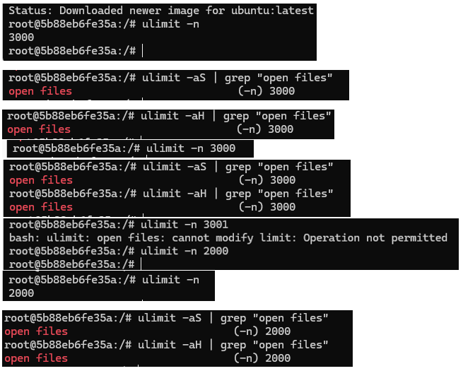

## 3.2


## 3.3 
Напишіть програму, що імітує кидання шестигранного кубика. Імітуйте кидки, результати записуйте у файл, для якого попередньо встановлено обмеження на його максимальний розмір (max file size). Коректно обробіть ситуацію перевищення ліміту.


## 3.4
Напишіть програму, що імітує лотерею, вибираючи 7 різних цілих чисел у діапазоні від 1 до 49 і ще 6 з 36. Встановіть обмеження на час ЦП (max CPU time) і генеруйте результати вибору чисел (7 із 49, 6 із 36). Обробіть ситуацію, коли ліміт ресурсу вичерпано.


## 3.5 
Напишіть програму для копіювання одного іменованого файлу в інший. Імена файлів передаються у вигляді аргументів.
Перший файл:

Виконуємо програму:
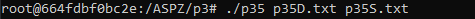
Другий файл:
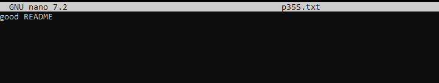

## 3.6 
Напишіть програму, що демонструє використання обмеження (max stack segment size). Підказка: рекурсивна програма активно використовує стек
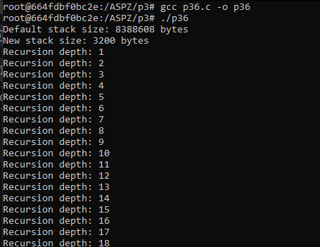


## 3.7
Встановити обмеження на кількість відкритих сокетів (ulimit -n) та запустити серверну програму.
bash ```ulimit -n 100```


```
for i in {1..150}; do
  (sleep 10 | telnet 127.0.0.1 8080) &
done
```


# Практична 4 (pr4)
## Завдання 4.1 (task1.c)
Скільки пам’яті може виділити malloc(3) за один виклик?
Параметр malloc(3) є цілим числом типу даних size_t, тому логічно максимальне число, яке можна передати як параметр malloc(3), — це максимальне значення size_t на платформі (sizeof(size_t)). У 64-бітній Linux size_t становить 8 байтів, тобто 8 * 8 = 64 біти. Відповідно, максимальний обсяг пам’яті, який може бути виділений за один виклик malloc(3), дорівнює 2^64. Спробуйте запустити код на x86_64 та x86. Чому теоретично максимальний обсяг складає 8 ексабайт, а не 16?
## Завдання 4.2 (task2.c)
Що станеться, якщо передати malloc(3) від’ємний аргумент? Напишіть тестовий випадок, який обчислює кількість виділених байтів за формулою num = xa * xb. Що буде, якщо num оголошене як цілочисельна змінна зі знаком, а результат множення призведе до переповнення? Як себе поведе malloc(3)? Запустіть програму на x86_64 і x86.
## Завдання 4.3 (task3.c)
Що станеться, якщо використати malloc(0)? Напишіть тестовий випадок, у якому malloc(3) повертає NULL або вказівник, що не є NULL, і який можна передати у free(). Відкомпілюйте та запустіть через ltrace. Поясніть поведінку програми.
## Завдання 4.4 (task4.c)
Чи є помилки у такому коді?
void *ptr = NULL;
while (<some-condition-is-true>) {
    if (!ptr)
        ptr = malloc(n);
    [... <використання 'ptr'> ...]
    free(ptr);
}
Напишіть тестовий випадок, який продемонструє проблему та правильний варіант коду.
## Завдання 4.5 (task5.c)
Що станеться, якщо realloc(3) не зможе виділити пам’ять? Напишіть тестовий випадок, що демонструє цей сценарій.
## Завдання 4.6 (task6.c)
Якщо realloc(3) викликати з NULL або розміром 0, що станеться? Напишіть тестовий випадок.
## Завдання 4.7 (task7.c)
Перепишіть наступний код, використовуючи reallocarray(3):
struct sbar *ptr, *newptr;
ptr = calloc(1000, sizeof(struct sbar));
newptr = realloc(ptr, 500*sizeof(struct sbar));

Порівняйте результати виконання з використанням ltrace.

## Завдання 4.8 (task8.c)
2 Напишіть програму для імітації витоку пам’яті та засічіть її за допомогою valgrind.


Використання:
```gcc -g -o task8 task8.c```
```sudo apt  install valgrind```
```valgrind --leak-check=full ./task8```


# Практична 5 (pr5)
## 2.Реалізуйте фрагмент коду, який зчитує за межами виділеного масиву без явного порушення доступу — і поясніть, чому це можливо.
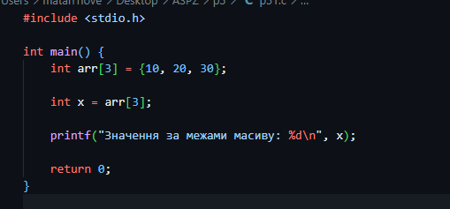
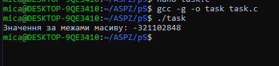
## Чому це можливо?
У мові C немає автоматичної перевірки меж масиву — звернення типу arr[3] просто обчислює адресу (arr + 3) без контролю. Це призводить до undefined behavior, але не завжди викликає помилку, бо пам'ять за межами масиву часто належить програмі (наприклад, інша локальна змінна або невикористана область). Помилка з порушенням доступу виникає лише тоді, коли звернення виходить за межі виділеної та захищеної ОС пам'яті.

# Практична 6 (pr6)
## 2.Створіть Dockerfile, що автоматично встановлює Valgrind, компілює програму та запускає її під Valgrind.
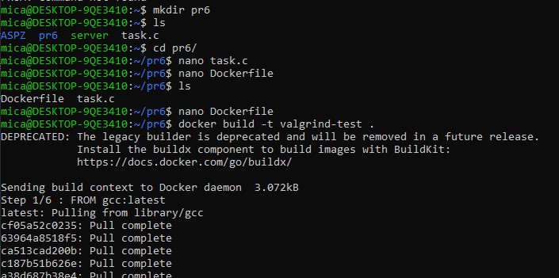
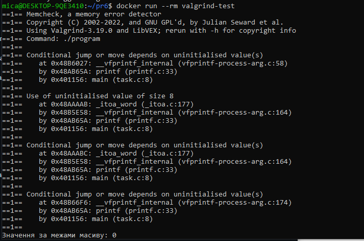

Dockerfile — це файл із інструкціями для Docker, що описує, як створити образ.
Команда docker build створює образ на основі Dockerfile.
Команда docker run запускає контейнер із цим образом.

# Практична 7 (pr7)

## Задача 1
Використайте popen(), щоб передати вивід команди rwho (команда UNIX) до more (команда UNIX) у програмі на C. Я використав who замість rwho


## Задача 2 
Напишіть програму мовою C, яка імітує команду ls -l в UNIX — виводить список усіх файлів у поточному каталозі та перелічує права доступу тощо. (Варіант вирішення, що просто виконує ls -l із вашої програми, — не підходить.)

Програма відкриває поточний каталог, проходить по кожному файлу в ньому, отримує про нього інформацію через stat(), формує рядок з правами доступу, власником, групою, розміром і датою зміни, а потім виводить усе це

## Задача 3
Напишіть програму, яка друкує рядки з файлу, що містять слово, передане як аргумент програми (проста версія утиліти grep в UNIX).
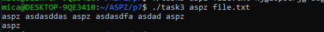
Програма читає файл построково і з задопомогою strstr() шукає задане слово

## Задача 4 
Напишіть програму, яка виводить список файлів, заданих у вигляді аргументів, з зупинкою кожні 20 рядків, доки не буде натиснута клавіша (спрощена версія утиліти more в UNIX).
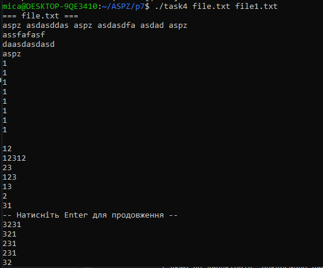
Спочатку програма перевіряє аргументи потім по черзі відкриває файли через fopen(), читає їх рядками за допомогою fgets(), виводить по 20 рядків через printf(), чекає Enter за допомогою getchar(), і після завершення закриває файл через fclose()

## Задача 5 
Напишіть програму, яка перелічує всі файли в поточному каталозі та всі файли в підкаталогах.

Спочатку програма відкриває каталог за допомогою opendir(), потім по черзі зчитує записи через readdir(), формує повний шлях до кожного файлу через snprintf(), перевіряє, чи це директорія, використовуючи stat(), і якщо це директорія, рекурсивно викликає list() для неї. Якщо це файл, програма виводить його шлях через printf(), а після завершення закриває каталог через closedir()

## Задача 6 
Напишіть програму, яка перелічує лише підкаталоги у алфавітному порядку.

## Задача 7
Напишіть програму, яка показує користувачу всі його/її вихідні програми на C, а потім в інтерактивному режимі запитує, чи потрібно надати іншим дозвіл на читання (read permission); у разі ствердної відповіді — такий дозвіл повинен бути наданий.
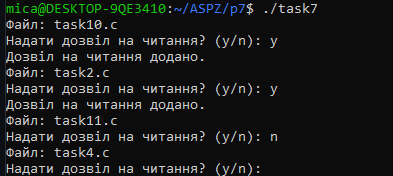
Спочатку програма відкриває поточний каталог через opendir(). Потім вона по черзі зчитує кожен файл в каталозі через readdir(). Якщо ім'я файлу .c, програма виводить його назву на екран за допомогою . Далі програма запитує у користувача чи потрібно надати дозвіл на читання для цього файлу через . Якщо користувач відповідає "y" або "Y", програма перевіряє наявність файла за допомогою stat(). Якщо файл існує, програма змінює його права доступу за допомогою chmod() і надає дозвіл на читання.

## Задача 8 
Напишіть програму, яка надає користувачу можливість видалити будь-який або всі файли у поточному робочому каталозі. Має з’являтися ім’я файлу з запитом, чи слід його видалити.

Спочатку програма відкриває поточний каталог за допомогою opendir(). Потім по черзі зчитує файли через readdir(). Для кожного знайденого файлу програма запитує у користувача, чи потрібно видалити цей файл через . Якщо відповідь (y або Y), програма видаляє файл за допомогою функції remove().

## Задача 9
Напишіть програму на C, яка вимірює час виконання фрагмента коду в мілісекундах.


## Задача 10
Напишіть програму мовою C для створення послідовності випадкових чисел з плаваючою комою у діапазонах: (a) від 0.0 до 1.0 (b) від 0.0 до n, де n — будь-яке дійсне число з плаваючою точкою. Початкове значення генератора випадкових чисел має бути встановлене так, щоб гарантувати унікальну послідовність. Примітка: використання прапорця -Wall під час компіляції є обов’язковим.
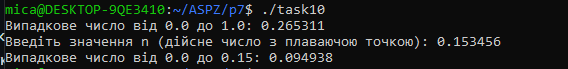
Спочатку програма ініціалізує генератор випадкових чисел через srand(). Потім вона генерує випадкове число в діапазоні від 0.0 до 1.0, ділячи результат функції rand() на максимальне можливе значення RAND_MAX. Після цього програма запитує значення числа n, а потім генерує випадкове число в діапазоні від 0.0 до n, множачи випадкове число в діапазоні від 0.0 до 1.0 на n.

## Завдання по варіанту 2
Реалізуйте утиліту командного рядка, яка виводить процеси, запущені лише з нестандартних шеллів, не використовуючи ps, top, htop.
